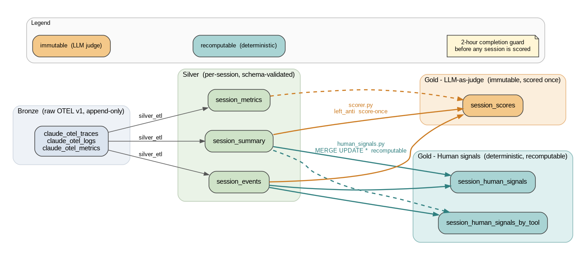

# AGENTS.md

Conventions, architecture, and guardrails for AI coding agents (Claude Code, Cursor, Copilot agents, etc.) and human contributors working in this repo. This is the load-bearing internal reference; the README is the human-facing entry point.

`CLAUDE.md` is intentionally a one-line redirect (`@AGENTS.md`) so every agent reads the same source of truth.

---

## 1. Project purpose

A Databricks PySpark project that scores Claude Code sessions captured as OpenTelemetry traces, logs, and metrics. It runs as a chained Databricks Asset Bundle job: a silver ETL converts bronze OTEL tables into per-session tables, then two parallel gold pipelines write scores — an LLM-as-judge pipeline (`scorer.py`) and a deterministic human-friction pipeline (`human_signals.py`).

A Databricks AI/BI dashboard (`dashboards/Claude Code Session Scores V1.lvdash.json`) reads from the gold tables.

---

## 2. Architecture overview



At a glance:

- **Bronze** is written by an OTLP proxy that lives in `IceRhymers/databricks-claude`. Schema is mirrored in `docs/bronze-schema.sql`. Do not assume column names beyond what's there.
- **Silver** (`silver_etl`) joins bronze on `attributes.getItem("session.id")` (or `sum.attributes.getItem("session.id")` for metrics) and produces three per-session tables: `session_summary`, `session_events`, `session_metrics`.
- **Gold (LLM judge)** — `scorer.py` builds a budget-bounded session "replay", calls `ai_query('databricks-claude-sonnet-4', ...)` with a structured response format, and writes one **immutable** row per completed session to `gold.session_scores`.
- **Gold (human signals)** — `human_signals.py` computes deterministic friction signals (reject rate, abort rate, correction intensity) into `gold.session_human_signals` (one row per session) and `gold.session_human_signals_by_tool` (one row per session/tool). **Recomputable** on every silver refresh.

| Stage  | Writer                  | Tables                                                                                  | Pattern                                                                            |
| ------ | ----------------------- | --------------------------------------------------------------------------------------- | ---------------------------------------------------------------------------------- |
| Bronze | external OTLP proxy     | `claude_otel_traces`, `claude_otel_logs`, `claude_otel_metrics`                         | append (raw OTEL v1 schema; see `docs/bronze-schema.sql`)                          |
| Silver | `silver_etl`            | `session_summary`, `session_events`, `session_metrics`                                  | MERGE on `session_id` for summary/metrics; delete-then-append for events           |
| Gold   | `score_sessions`        | `session_scores`                                                                        | `left_anti` against existing rows — score once per session, then **immutable**     |
| Gold   | `score_human_signals`   | `session_human_signals`, `session_human_signals_by_tool`                                | every completed session re-MERGEd on each run — **recomputable**                   |

All silver and gold tables use Delta with `CLUSTER BY AUTO`. Scoring jobs only consider sessions whose `session_end` is more than 2 hours old, to avoid scoring in-flight work.

Silver `session_events` is a **union of six event projections** (USER_PROMPT, LLM_CALL, TOOL_CALL, TOOL_DECISION, TOOL_RESULT, ERROR variants) — every projection must include the **same column list** in the same order, including `prompt_id`, `tool_use_id`, and `decision_source`.

---

## 3. Critical invariants / contracts

Treat the items in this section as load-bearing. Tests pin most of them; do not remove the assertions without a deliberate reason.

1. **NULL ≠ 0 for friction scores.** `human_friction_score` is `NULL` when `signal_strength` is false. Don't replace with 0 — `compute_friction_score` and the SQL formula both encode this contract and tests assert it.
2. **Scores are immutable; signals are recomputable.**
   - `scorer.py` uses a `left_anti` join against existing `session_scores` so a session is scored exactly once.
   - `human_signals.py` has **no** `left_anti` gate — every completed session is re-MERGEd on every run with `WHEN MATCHED THEN UPDATE SET *`. The `test_no_left_anti` and `test_first_run_backfills_all_completed_sessions` tests enforce this distinction.
3. **Completion guard.** Both gold pipelines filter `session_end < current_timestamp() - INTERVAL 2 HOURS` before scoring, to avoid scoring active sessions. Keep that filter intact.
4. **Per-tool delete-then-MERGE.** `session_human_signals_by_tool` does a `DELETE FROM ... WHERE session_id IN (...)` *before* the MERGE, so tools that disappeared between runs are dropped. Don't replace with a plain MERGE.
5. **Correction window is `<=` 30s.** `_CORRECTION_WINDOW_SECONDS = 30` and the predicate is boundary-inclusive (`<=`). Window must `partitionBy("session_id").orderBy("event_ts", "event_type")` for deterministic ordering under timestamp ties.
6. **Modify decisions are excluded.** `detail_name.isin("accept", "reject")` — `modify` and any other value are excluded from both numerator and denominator of `reject_rate`.
7. **`silver_events` write uses `mergeSchema=true`** with `saveAsTable(..., mode="append")`. The `_ensure_table_with_clustering` helper creates an empty `CLUSTER BY AUTO` Delta table on first run.
8. **`RESPONSE_FORMAT` and `FLAT_SCHEMA` move together.** In `scorer.py`, the `ai_query` structured-output schema and the `from_json` schema must always match. Adding/removing judgment fields means updating both **and** the `gold.session_scores` DDL.

### Data contract — schema changes are breaking

The bronze→silver→gold schema contract is the load-bearing API of this repo. Treat the following as breaking changes that require an explicit human-reviewed migration:

- Removing or renaming any column on `session_summary`, `session_events`, `session_metrics`, `session_scores`, `session_human_signals`, or `session_human_signals_by_tool`.
- Changing the `MERGE` key for any of those tables (today: `session_id`, plus `tool_name` for the `_by_tool` table).
- Changing the meaning of `signal_strength`, `human_friction_score` (NULL-not-0), or any `*_rate` column.

When a schema change *is* approved, include in the PR:

- The DDL change.
- The transform change.
- A "Migration" note in the PR body describing what to run on existing tables (e.g. `ALTER TABLE ... ADD COLUMNS ...`, or a one-shot backfill script).

---

## 4. Module map

| Path                                                   | What it does                                                                                                  |
| ------------------------------------------------------ | ------------------------------------------------------------------------------------------------------------- |
| `claude_otel_session_scorer/silver_etl.py`             | Bronze→silver. Three builders: `_build_session_summary`, `_build_session_events`, `_build_session_metrics`    |
| `claude_otel_session_scorer/scorer.py`                 | LLM-as-judge. `format_event_line` / `split_into_interactions` / `compress_interaction` / `build_replay_text`  |
| `claude_otel_session_scorer/human_signals.py`          | Deterministic friction signals. Pure-Python `compute_friction_score` mirrors the SQL formula                  |
| `tests/`                                               | Each production module has a sibling `test_*.py`; tests use `MagicMock(SparkSession)` plus source inspection  |
| `docs/bronze-schema.sql`                               | Reference DDL for bronze OTEL tables                                                                          |
| `docs/pipeline.png`                                    | Rendered pipeline diagram (source: `docs/pipeline.dot`-style content; regenerate with Graphviz)               |
| `databricks.yml`                                       | Asset Bundle: wheel artifact, scheduled `Claude OTEL Pipeline` job, three Python wheel tasks                  |
| `dashboards/Claude Code Session Scores V1.lvdash.json` | AI/BI dashboard reading from gold tables                                                                      |

---

## 5. Development setup

### Local

```bash
# 1. Install Poetry, then dependencies
curl -sSL https://install.python-poetry.org | python3 -
poetry install

# 2. Authenticate Databricks Connect (Python 3.12, runtime 18.0.5 client)
#    Configure DATABRICKS_HOST + DATABRICKS_TOKEN (or a profile) per
#    https://docs.databricks.com/dev-tools/databricks-connect.html

# 3. Run a pipeline locally against a remote workspace
poetry run silver_etl \
  --bronze-schema my_catalog.claude \
  --silver-schema my_catalog.claude_silver

poetry run score_sessions \
  --silver-schema my_catalog.claude_silver \
  --gold-schema   my_catalog.claude_gold

poetry run score_human_signals \
  --silver-schema my_catalog.claude_silver \
  --gold-schema   my_catalog.claude_gold
```

### Databricks

The `databricks.yml` Asset Bundle defines a daily-at-1am-UTC job (`Claude OTEL Pipeline`) with `silver_etl` followed by `score_sessions` and `score_human_signals` running in parallel.

```bash
# Build the wheel and deploy the bundle
databricks bundle deploy --target dev

# Run on demand
databricks bundle run otel_pipeline_job --target dev
```

Schemas are passed as job parameters (`bronze_schema`, `silver_schema`, `gold_schema`) and default to `tanner_fevm_catalog.*`.

### Databricks-specific notes

- **Three-part names everywhere.** All `--*-schema` flags take `catalog.schema`. Tables are then `f"{schema}.{name}"`. Don't hardcode catalogs.
- **`ai_query` response format.** `scorer.py` declares both `RESPONSE_FORMAT` (the structured-output schema) and `FLAT_SCHEMA` (the `from_json` schema). Keep them in lockstep when adding/removing judgment fields.
- **Auto-clustering.** Every silver/gold table is created with `CLUSTER BY AUTO` (`option("clusterByAuto", "true")` for the helper, `CLUSTER BY AUTO` in DDL strings).
- **MERGE pattern.** `WHEN MATCHED THEN UPDATE SET * / WHEN NOT MATCHED THEN INSERT *` is the canonical idempotent upsert. Use a `createOrReplaceTempView` source view, then a `MERGE INTO` SQL string.
- **Spark session.** Always use `create_spark_session()` from the module — it transparently picks Databricks Connect serverless locally vs. the ambient session inside DBR. Don't `SparkSession.builder.getOrCreate()` directly.
- **`spark.stop()`** should only run when off-cluster. `scorer.py` and `human_signals.py` already gate on `DATABRICKS_RUNTIME_VERSION`; preserve that.

### Configuration

The pipelines take their schema names from CLI flags; nothing else is configured via env vars. Two env vars influence Spark session creation:

| Variable                                            | Effect                                                                                                                       |
| --------------------------------------------------- | ---------------------------------------------------------------------------------------------------------------------------- |
| `DATABRICKS_RUNTIME_VERSION`                        | When **set** (running inside a Databricks cluster), `create_spark_session()` uses the ambient `SparkSession`.                |
| `DATABRICKS_HOST` / `DATABRICKS_TOKEN` (or profile) | When `DATABRICKS_RUNTIME_VERSION` is unset, `databricks-connect` opens a serverless session against the configured workspace. |

Unity Catalog three-part table names are required for every `--*-schema` flag (`catalog.schema`).

---

## 6. Testing

```bash
poetry install           # one-time
poetry run pytest tests/ -v
# or:
make test
```

Tests do **not** spin up a real Spark — they wrap `MagicMock` and validate behavior either via mock-call assertions on `spark.sql(...)` or via `inspect.getsource(...)` against pinned strings. When you add a feature, add the equivalent test in the matching style.

Any new pipeline module — or any new transform inside an existing pipeline — must ship with a PySpark unit test in `tests/test_<module>.py`. Follow the established patterns:

1. **`MagicMock` Spark.** Use the `_make_mock_spark` / `_sql_calls` helpers as the template. Never instantiate a real `SparkSession` in tests.
2. **Assert on `spark.sql(...)` calls.** Walk `spark.sql.call_args_list` to verify DDL, MERGE, and DELETE statements landed.
3. **Source-level invariants where shape matters.** Use `inspect.getsource(fn)` and substring asserts to lock in things like `"INTERVAL 2 HOURS"`, `<= _CORRECTION_WINDOW_SECONDS`, `groupBy("session_id", "tool_name")`, etc.
4. **Pure helpers covered directly.** `compute_friction_score`, `split_into_interactions`, `build_replay_text`, `compress_interaction`, `format_event_line` all have direct unit tests — keep that.
5. **`main()` round-trip.** Each entry point has a `test_main_creates_spark_and_stops` that patches `create_spark_session` and `run_*`, asserts the right CLI args route through, and asserts `spark.stop()` is called. Mirror this for any new entry point.

Tests must remain offline — never introduce a real LLM/API call in a test.

---

## 7. Lint and formatting

`ruff` is the only linter/formatter. CI fails on either `ruff check` or `ruff format --check` finding diffs.

```bash
make lint        # ruff check . && ruff format --check .
make fmt         # ruff format .
ruff check .     # direct
ruff format .    # direct
```

`pyproject.toml` sets `tool.ruff.line-length = 100`.

CI (`.github/workflows/ci.yml`) runs `ruff check`, `ruff format --check`, `pytest`, and `poetry build` + `twine check` on every push and PR to `main`. All four must pass.

---

## 8. Commit & PR conventions

### Commit messages

Use **conventional commit** prefixes — they're how `release-please`-style tooling and humans skim history. Branch-name prefixes do **not** count; the prefix must be in the commit message itself.

| Prefix      | Use for                                                                |
| ----------- | ---------------------------------------------------------------------- |
| `feat:`     | New user-visible capability (new column, new pipeline, new CLI flag)   |
| `fix:`      | Bug fix in an existing pipeline / transform / test                     |
| `chore:`    | Tooling, deps, CI, formatting-only changes                             |
| `docs:`     | README, AGENTS.md, comments, dashboards' descriptive fields            |
| `test:`     | Test-only additions or refactors (no production code change)           |
| `refactor:` | Internal restructure with no behavioral change                         |

Keep the subject line ≤ 72 chars. Use the body to describe *why* and any migration impact.

### PR checklist

Before requesting review, verify:

- [ ] `make lint` passes (`ruff check` + `ruff format --check`)
- [ ] `make test` passes (`poetry run pytest tests/ -v`)
- [ ] `poetry build` succeeds and `twine check dist/*` is clean (CI does this — local optional)
- [ ] Conventional-commit prefix on every commit
- [ ] Any new gold/silver column is added to:
  - the corresponding builder / SELECT
  - the `CREATE TABLE` DDL string (if applicable)
  - the relevant tests
- [ ] If you touched `human_signals.py`: confirmed no `left_anti`, no `ai_query`, no UDFs, and `signal_strength=False ⇒ score is NULL`
- [ ] If you touched `scorer.py`: confirmed `left_anti` against `session_scores` is intact and `RESPONSE_FORMAT` / `FLAT_SCHEMA` / DDL move together
- [ ] If you changed any silver event projection: all six arms still emit the same column list, including `prompt_id`, `tool_use_id`, `decision_source`
- [ ] PR body calls out any schema-level migration step a Databricks operator must run

---

## 9. Scope of autonomous agent edits

**Agents may autonomously:**

- Add or modify PySpark transforms inside `claude_otel_session_scorer/` so long as bronze→silver→gold contracts hold.
- Add tests under `tests/` for new behavior.
- Update CI (`.github/workflows/ci.yml`), `Makefile`, `pyproject.toml` dependencies — provided lint and the full test suite still pass.
- Edit `README.md`, `AGENTS.md`, and `docs/` content (including regenerating `docs/pipeline.png` from a DOT source).

**Agents must NOT autonomously:**

- Change the bronze table DDL in `docs/bronze-schema.sql` — it is mirrored from `IceRhymers/databricks-claude` and must stay in sync upstream first.
- Rotate Unity Catalog defaults in `databricks.yml` (`tanner_fevm_catalog.*`) without explicit human approval.
- Add, remove, or rename a `[tool.poetry.scripts]` entry point — these are referenced by `databricks.yml` job tasks and breaking them silently breaks production.
- Introduce real LLM/API calls in tests (tests must remain offline; use `MagicMock` Spark + source inspection).
- Commit any wheel, build artifact, or `.databrickscfg`-style credential.

---

## 10. What NOT to do

- Don't make `human_signals` immutable (no `left_anti` gate, no "skip if already scored").
- Don't make `scorer` recomputable (no MERGE-without-anti-join; rescoring a session would be wasteful and breaks the immutable-history contract).
- Don't replace NULL with 0 in friction outputs.
- Don't add `ai_query`, UDFs, or LLM calls to `human_signals.py` — `test_no_udfs_or_ai_query` explicitly forbids it.
- Don't widen the `TOOL_DECISION` filter beyond `("accept", "reject")` without updating the test that pins it.
- Don't drop `prompt_id`, `tool_use_id`, or `decision_source` columns from any of the six `_build_session_events` projections — tests count `alias("...")` occurrences and require `>= 6`.
- Don't change `_CORRECTION_WINDOW_SECONDS` to `<` instead of `<=`; tests assert boundary inclusivity.
- Don't introduce env-var-driven config; CLI flags are the only knob.

---

## 11. When in doubt

- Read the matching `tests/test_*.py` first — it encodes the contract more precisely than prose.
- Prefer adding a new test that pins your new invariant rather than relaxing an existing one.
- If a test asserts a string like `'isin("accept", "reject")'` and your refactor would break that substring, the *test* is enforcing a contract — don't just delete the assertion. Either keep the substring or update the test deliberately and explain why in the PR.
